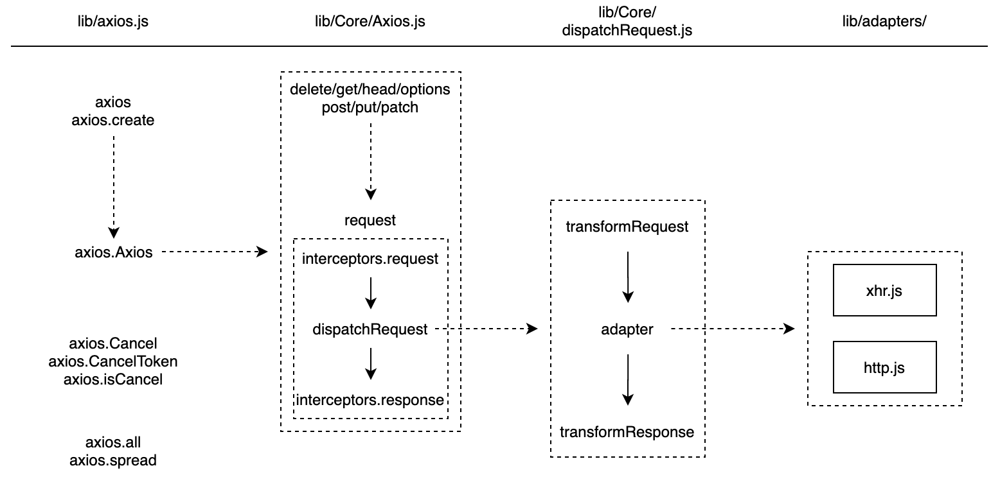
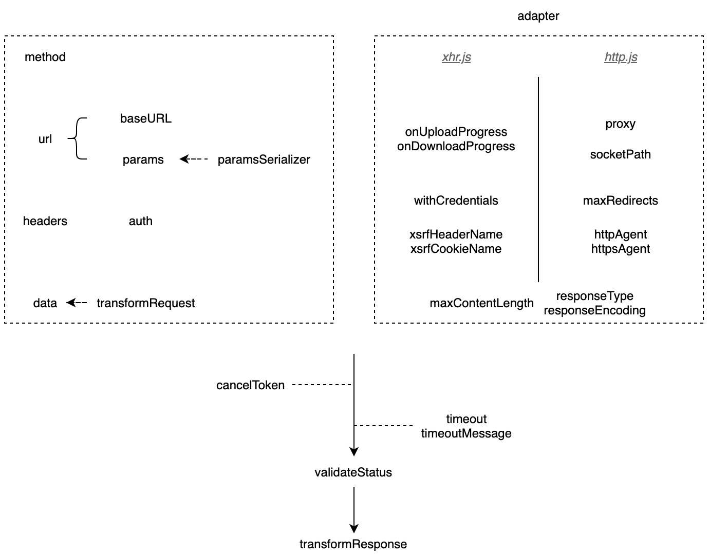

# You Don't Know Axios

> Promise based HTTP client for the browser and node.js

[axios][axios] is one of the most famous Javascript request libraries. According to Github's data, it is used by 2.1 millions repositories now (Feb 2020).

Purposes of this tutorial are,

- Clarifying misleading behaviors and usages
- Introducing design principles and internal implementations
- Helping users be able to solve problems by themselves
- Avoiding invalid or weak issues or pull requests opened
- Recording personal study notes
- Practicing English writing skills

I'd like to divide things into 3 questions,

- [Design Theories](#design-theories), why does axios look like this?
- [Usage Knowledges](#usage-knowledges), what didn't mention clearly in axios official document?
- [Problem Solutions](#problem-solutions), how to analyze a problem and open a good issue or pull request?

## Design Theories



### Keep Simple

The most impressive design in axios is its flexible architecture, including basic configs, interceptors, transformers and adapters. The core is simple and stable, while users can achieve customized functionalities by providing their own implementations. Before requesting for new features, think twice whether it is important and common enough to be added, or it can be solved by current hooks.

### Promise Based

Make sure you are familiar with asynchronous programming when using axios, especially for Promise and async/await. Because axios connects internal things by Promise.

## Usage Knowledges

Let's follow the structure of official document. In each topic, I will give some examples to explain the misleading or unclear points. To keep this document not out-of-date, the detailed logic will not be introduced too much. It may change between different versions, please read specific axios source codes.

### axios API

#### Note the difference and relationship between `axios` and `Axios`.

Using terms in [object-oriented programming][oop], `Axios` is the *class* which provides core `request` method and other [method aliases][request-method-aliases], and `axios` is an instance of `Axios` created by `axios.create` with the default configs.

Before returning, `axios.create` will bind the instance to `Axios.prototype.request`, so `axios` is also a function same with `Axios.prototype.request`.

Something special is that, `axios` has lots of *static* members and methods beside of `axios.create`, i.e. `axios.Cancel/CancelToken/isCancel` and `axios.all/spread`.

```js
axios.Cancel // object
axios.create(config).Cancel // undefined
```

#### The position of parameter `config` is different among request methods.

For beginners, it may be a little confused. In fact, you can remember easily by asking yourself whether it has a `data` parameter.

```
axios.request([url, ]config) // first or second
axios.delete/get/head/options(url, config) // second
axios.post/put/patch(url, data, config) // third
```

### Request Config



The above diagram shows all request configs.

- The left dotted box contains 4 main configs(`method`, `url`, `headers`, `data`), which are corresponding to 4 parts in HTTP request format, and their related things.
- The right dotted box is `adapter` related. A separate line divides configs into browser only(`xhr.js`) and server only(`http.js`). Others configs should be applicable to both sides, but are not fully supported.
- The rest is configs that control the process, including cancellation, timeout and response transforming.

#### Should `method` be lower cases or upper?

According to HTTP specifications, the method field must be all upper cases. The default 2 adapters have done that internally. So axios users can use case-insensitive `method`.

I used to worry about headers merging. But in fact, axios will convert received `method` to lower cases and keep cases unchanged until sending out.

#### Understand how `baseURL` concats with `url`.

Don't think it as simple as `baseURL + url`. A bad example is,

```js
axios({
  baseURL: 'http://a.com/b?c=d',
  url: '&e=f'
})
```

#### Nightmares of `headers`: CORS, cookies and `auth`.

First of all, `headers` in axios are request headers, not response headers. Therefore, [CORS][mdn-cors] related problems can't be resolved by adding values in `headers`. Considering many users are confused with CORS, I'd like to give some tips about it.

- CORS problems are browser only, when your site requests a resource that has a different origin (domain, protocol, or port) from its own. Node.js scripts and [Postman][postman] don't have this kind of trouble.
- Sometimes, take it easy for those additional OPTIONS requests. They are [preflighted requests](https://developer.mozilla.org/en-US/docs/Web/HTTP/CORS#Preflighted_requests), which are very normal things and not strange bugs caused by axios.
- If some headers couldn't be accessed in your codes, even though they were visible in the network panel, please make sure the server responses correct [Access-Control-Expose-Headers](https://developer.mozilla.org/en-US/docs/Web/HTTP/CORS#Access-Control-Expose-Headers) header.
- As [MDN](https://developer.mozilla.org/en-US/docs/Web/HTTP/CORS#Credentialed_requests_and_wildcards) says, when responding to a credentialed request, the server must specify an origin in the value of the `Access-Control-Allow-Origin header`, instead of specifying the "*" wildcard. Or cookies will not be send, even though `withCredentials` has been set true in axios.

Some users complains cookies can't be set when the server has responded `Set-Cookie` header. You may check whether they are [HttpOnly or Secure](https://developer.mozilla.org/en-US/docs/Web/HTTP/Cookies#Secure_and_HttpOnly_cookies), and scopes of cookies.

I prefer to set `Authorization` manually in `headers` to authorize, unless you know exactly what happens in axios. Here are some warnings for users,

- If no `auth` was set, http adapter will try to extract user and password from the url, while xhr adapter does nothing.
- And xhr adapter may not able to handle special characters well.

Merging of headers will be introduced in [Config Defaults](#config-defaults) section.

#### Distinguish `params` with `data`.

When you want to send request data, read the endpoint document carefully to make sure where it should be.

- If should be seen in the url, it is `params`, otherwise is `data`.
- If the method is `get`, it is `params` with 99% possibilities. Theoretically, `get` can also send with `data`, but is very rare.
- If the method is `post`, it is `data` with 80% possibilities. `post` usually works with `data` and less will have both.
- For other methods, apply the similar strategy.

```js
axios({
  url: 'http://a.com/b?c=d'
})

// is as well as

axios({
  url: 'http://a.com/b',
  params: {
    c: 'd'
  }
})
```

#### Serialize `params` correctly.

The default serialization can only handle simple `params`. If you find out the built url is not as expected, especially when your `params` contains arrays or nested objects as values, you may need to set `paramsSerializer`.


```js
var qs = require('qs'); // https://www.npmjs.com/package/qs

// url?a%5B0%5D=1&a%5B1%5D=2&b%5Bc%5D=42
axios(url, {
  params: {
    a: [1, 2],
    b: {
      c: 42
    }
  },
  paramsSerializer(params) {
    // or any other libraries you like
    return qs.stringify(params);
  }
})
```

#### Submit `data` successfully.

Here must be the most severely afflicted area. Lots of axios issues seek help due to it.

> In requests, (such as POST or PUT), the client tells the server what type of data is actually sent.

So, `data` must match with the header [Content Type][mdn-content-type]. Followings are its common values.

- `text/plain`
- `application/json`

In this case, `data` should be JSON format. If `data` is an object (not null), the default `transformRequest` will set Content-Type to it automatically.

```js
axios({
  data: {
    a: 42
  }
})

// equals to 

axios({
  data: JSON.stringify({a: 42})
})
```

- `application/x-www-form-urlencoded`

As the name indicated, `data` should be URL/URI encoded. If `data` is an instance of URLSearchParams, the default `transformRequest` will set Content-Type to it automatically.

Note that it treats numbers as strings, while `application/json` is type-sensitive.

```js
var data = new URLSearchParams();
data.append('a', 42)

axios({
  data: data
})

// equals to 

var qs = require('qs'); // https://www.npmjs.com/package/qs

axios({
  data: qs.stringify({a: '42'})
})
```

#### Why was't `timeout` fired at the right time?

axios supports `timeout` by underlayer APIs, XMLHttpRequest's [timeout event](https://developer.mozilla.org/en-US/docs/Web/API/XMLHttpRequest/timeout_event) and [request.setTimeout](https://nodejs.org/api/http.html#http_request_settimeout_timeout_callback) in Node.js. You may face browser compatibilities problems or Node.js environments problems.

If you set `timeout` to a small value, i.e. 1 or 2, make sure it doesn't conflict with Javascript's [event loop](https://developer.mozilla.org/en-US/docs/Web/JavaScript/EventLoop).

Now axios doesn't have a convenient way to validate a timeout error, except for finding special patterns in the error message. And `timeoutErrorMessage` is browser only yet.

Someone wishes other types of timeout. Looks like [got](https://github.com/sindresorhus/got#timeout) provides them very well.

#### Do you use the right `adapter`?

For environments like Electron or Jest, both XMLHttpRequest and process are existed in the global context. axios may not select the right `adapter` as you want.

```js
axios.defaults.adapter // [Function: httpAdapter] or [Function: xhrAdapter]
```

And you can set `adapter` explicitly.

```js
axios({
  adapter: require('axios/lib/adapters/http')
})
```

If you like more fashion [Fetch API](https://developer.mozilla.org/en-US/docs/Web/API/Fetch_API), sorry that axios has not supported yet. You have write one by yourself or search in npm.

### Response Schema

You may expect to also get a response when non-2XX status code returns. Remind that `validateStatus` checks status code first. See [Request Config](#request-config).

Then don't forget to config `validateStatus` as you wish.

```js
axios(url, {
  validateStatus: function (status) {
    return status >= 200;
  }
})
```

### Config Defaults

Final configs come from three parts, the axios default, the instance and the request.

```js
// `axios` only use the axios default as config defaults, see lib/defaults.js
axios(requestConfig)

// `axios.create` merges the axios default with `instanceConfig` as config defaults
var instance = axios.create(instanceConfig)
instance(requestConfig)
```

The main merging strategy changes among versions,

- <= 0.18, as simple as `Object.assign`, which means values with the same key will be replaced by the later one. No deep merging for nested objects.
- 0.19, introduces deep merging, but with some bugs. Arrays are merged like objects. Some config fields (i.e. `params`) should be supported but not, and custom default fields are lost totally.
- &gt;= 0.20, hope axios can fix them and work perfectly again.

#### More stories about `headers`

For `headers`, it includes more things. You can set default headers for methods.

```js
// their priorities should be 1 < 2 < 3
var instance = axios.create({
  headers: {
    // 1. common headers
    common: {},
    // 2. methods headers
    get: {},
    // 3. request specified
    'Content-Type': 'application/x-www-form-urlencoded'
  }
});

// not `get` method, so only has 1 & 3, but without 2
instance.post(config)
```

The extra design also brings about understanding pressures and shortcomings. Because you can't use a header with the same name with HTTP methods. But I think it should be avoided anyway.

Let's ask a similar question like `method`, should `headers` be case sensitive or not? The answer is derived from HTTP specifications, too. The protocol has no requirements for it, which means case insensitive and everything will be send exactly as you requested to the server.

After configed, `headers` may be modified in many stages. If your headers become what you don't expect, please check and debug them carefully. Suggest to use first-upper-letter word format with `-` connected, as axios doesn't handle case insensitive very well.

- Request and response hooks, i.e. interceptors and `transformRequest`.
- `lib/adapters/xhr.js`,
  - `Content-Type` will be removed if `data` is FormData or undefined, in order to let the browser to set.
  - `Authorization` will be generated from `auth`.
  - `xsrfHeaderName` will be set with the value from cookie `xsrfCookieName`.
- `lib/adapters/http.js`,
  - `User-Agent` will be set if no user agent is provided.
  - `Content-Length` will be set to match the request data.
  - `Authorization` will be removed because `auth` is included in the options.
  - `Proxy-Authorization` will be set if the proxy contains an `auth`.
  - Response header `Content-Encoding` will be removed if decompressed.

### Interceptors

From [Design Theories](#design-theories), we can know the position of interceptors. They are the beginning part (request interceptors) and the ending part (response interceptor) of the handlers chain.

```js
axios.interceptors.request.use(requestResolve1, requestReject1);
axios.interceptors.request.use(requestResolve2, requestReject2);
axios.interceptors.response.use(responseResolve1, responseReject1);
axios.interceptors.response.use(responseResolve2, responseReject2);

axios(config).then(thenBlock).catch(catchBlock);

// equals to

Promise.resolve(config)
  .then(requestResolve2, requestReject2)
  .then(requestResolve1, requestReject1)
  .then(dispatchRequest, undefined)
  .then(responseResolve1, responseReject1)
  .then(responseResolve2, responseReject2)
  .then(thenBlock).catch(catchBlock);
```

Note that,

- The real request is not send immediately when you call `axios(config)`, because `dispatchRequest` is one of `then` handlers. Avoid doing synchronous time-consumed tasks after axios calls.

```js
axios(config);

setTimeout(function () {
  // do time-consumed tasks in next event loop
});
```

- As well as `promise.then(onResolve, onReject)`, the reject handler can't catch errors thrown in the resolve handler of the same `use` pair. For example, `responseReject1` will not be invoked even if `responseResolve1` thrown something, but `responseReject2` can.
- If you want to break the chain and trigger the final catch block, don't return quietly in any reject handlers.

```js
axios.interceptors.request.use(requestResolve, function () {
  throw new Error('reason');

  // or

  return Promise.reject(new Error('reason'));
});
```

- You can pass `async` functions (imaging them as functions return a Promise) as interceptor handlers, as long as the chain is connected correctly.

```js
axios.interceptors.request.use(async function (config) {
  await something;
  return 42;
});

// equals to

axios.interceptors.request.use(function (config) {
  return Promise.resolve(42);

  // as well as

  return 42;
});
```

- The returned value of `use` is interceptor identifier, which is used to eject the interceptor, instead of the instance of interceptor.

```js
var id = axios.interceptors.request.use(requestResolve);
axios.interceptors.eject(id);
```

- Comparing with the `use` sequences, the execution order of request interceptors is reversed. It is not straight-forward and a little strange, but has been there for many years.
- Interceptors can't be inherited. You have to save them somewhere and register again.

### Handling Errors

Nothing special has to be mentioned here. Read the official document is enough. Several kinds of errors may be caught. 

- `AxiosError`, which is thrown by axios initiative and has `isAxiosError: true` as mark.
- `Cancel`, which is caused by cancellation and can be recognized by `axios.isCancel` method.
- Other errors that can be from anywhere. Find out the place carefully.

### Cancellation

`axios.Cancel` is a simple wrapper of string, with a helper method (`axios.isCancel`) to recognize it. axios creates instance of it internally, so I don't know the meaning of exposing it.

```js
var cancelInst = new Cancel(message);
axios.isCancel(cancelInst); // true
```

`axios.CancelToken` is a constructor, which is used to create instances as the value of `cancelToken` in request config. The principle is a little complex. Talk is cheap, let me show you codes.

```js
var outterCancelFn;

config.cancelToken = new CancelToken(function executor(cancelFn) {
  // 1. A Promise will be created in the constructor,
  // and its `resolve` callback is saved temporarily

  // 2. Wrap a callback `cancelFn` based on `resolve`,
  // as the parameter of `executor`, and call `executor` immediately

  /**
   * In fact, `cancelFn` looks like,
   *
   * function cancelFn(message) {
   *   // 1. create an instance of Cancel and save it as a member of CancelToken instance
   *   // 2. invoke `resolve` with the saved Cancel instance
   * }
   */

  // Save `cancelFn` in an outter value and call it with error message at any desirable time 
  // Why can it cancel the request?
  // 1. `dispatchRequest` will check the member field of CancelToken, and throw it if found
  // 2. adapters will wait the Promise to be resolved, and throw the resolved value
  outterCancelFn = cancelFn;
})
```

`axios.CancelToken.source` is a factory method that does similar things.

```js
var source = CancelToken.source();
// source.token, which is used as `config.cancelToken`
// source.cancel, which is `cancelFn` in above example
```

## Problem Solutions

### Learn to triage issues first.

Relax when you didn't receive the expected response. Some checkpoints and ideas can be,

- Make sure the network and server works well, without problems like CORS/ATS blocking. It can be approved by switching to other request libraries, i.e. jQuery, curl.
- Make sure the program runs like you designed, especially that Promise callbacks are connected well.
- Make sure you used axios correctly, without misleading ways in this article. You can also search in Google, stackoverflow and old axios issues.
  - Don't reply to issues with only "Same here" or "+1" (reactions are enough). That doesn't make sense, expecting for telling people "Oh, a new poor guy!". Try to give your **NEW** information and suggestions.
  - Don't reply to closed issues unless they are unsolved without any reasons. Normally maintainers will ignore notifications from closed issues or pull requests.
- If all of above answers is yes,
  - compare the **REAL** requested url and headers with required and find out why. "REAL" means reading from browsers' network panel, using softwares (i.e. Charles or Wireshark) to capture packets, or at least debugging in adapters of axios.
  - test similar scenarios by underlayer APIs (XMLHttpRequest or http).

Finally, you still determine to shot an issue. OK, as long as keeping in mind how readers will feel when reading your issue and whether they can help.

- **Is it reproducible and include enough information?** Follow the issue template is the most basic requirement. Try to give a minimum and runnable code example, instead of lots of personal descriptions. Once you mentioned the real adapter is xhr or http, it will reduce 50% of work to resolve the issue.
- **Choices will always better than questions.** Giving possible solutions as far as you can is much more appreciated. Open source needs powers from the community, and readers/maintainers are just normal developers like you, who also likely don't know answers.

### Contribute with a pull request.

Great! Now you are the smartest man/woman in the world, because you find a bug/improvement that nobody realized before. Like other projects, axios provides its [Contributing guide](https://github.com/axios/axios/blob/master/CONTRIBUTING.md). And I want to emphasize some key points, which are also applicable to all open source projects.

- **Testing is more important than codes.** Nobody will never make mistakes and can always cover every corner cases. Solid testings include both positive and negative cases.
- **Change as less as possible.** Unless resulting in breaking features or introducing bugs, don't touch anywhere. Sometimes "sweet" enhancements will cause much more maintaining burdens.
- **Be patient, persistent, and always keep an eye on it**. It may be hard, but still hope contributors treat them as targets. axios is famous but not actively maintained. Revising repeatedly according to review suggestions may take weeks or months. If anyone has time, feel free to leave comments to help review pull requests.

[axios]: https://github.com/axios/axios
[request-method-aliases]: https://github.com/axios/axios#request-method-aliases
[mdn-content-type]: https://developer.mozilla.org/en-US/docs/Web/HTTP/Headers/Content-Type
[mdn-cors]: https://developer.mozilla.org/en-US/docs/Web/HTTP/CORS
[oop]: https://en.wikipedia.org/wiki/Object-oriented_programming
[postman]: https://www.postman.com/
